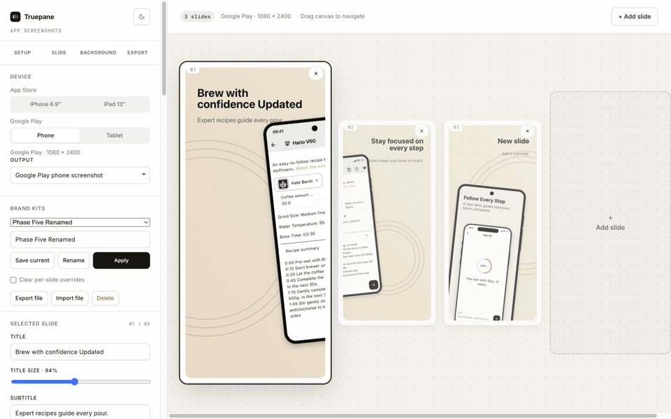

# Truepane

**Truepane** is a free, open-source screenshot-set builder for the App Store and Google
Play. Compose and localize a complete release visually in the browser, or hand the same
project to an AI agent through the bundled MCP server. Try it at
[truepane.dev](https://truepane.dev).

Everything renders to `<canvas>` in the browser. Screenshots stay on your machine.
Optional AI helpers send only the text you ask them to process (and, when supplied,
your Groq API key) to the configured Edge Function and model provider. Google Fonts
are also loaded from Google's CDN unless you use a system or uploaded font.



## Guides

- [Create App Store screenshots with Codex or Claude Code](docs/tutorials/create-app-store-screenshots-with-codex-or-claude-code.md)
- [Update localized App Store screenshots without uploading them](docs/tutorials/update-localized-app-store-screenshots-without-uploading.md)

## Why this exists

Most screenshot generators composite a pre-rendered PNG of a phone. This one **draws
the device frame procedurally** on a canvas — body, bezel, buttons, camera, and the
screen mask are all geometry, not bitmaps. That choice drives most of what makes the
tool small, sharp, and cheap to run.

## Features

- **Procedural device frames** at exact store sizes: iPhone 6.9″ (1320×2868), iPad 13″
  (2064×2752), Android phone (1080×2400), Android tablet (1600×2560).
- **Backgrounds = fill + shape.** A fill layer (solid, or linear/radial gradient) plus an
  optional shape overlay (rings, blobs, waves, dots, mesh, arcs, triangles, grid, zigzag,
  bubbles), each with independent colors. Shapes flow continuously across the strip and
  reproduce exactly from a stored seed.
- **Custom background images**: upload a backdrop, then control blur, fit, opacity, scrim,
  and whether it spans one slide or the full strip. Imported images are resized locally
  to a practical render budget.
- **One composable shape family.** Alongside the ten fixed looks, `Custom…` is a parameter
  surface rather than a preset: pick a primitive (ring, disc, arc, triangle, bar, blob) and
  an arrangement (scatter, grid, row, radial, wave), then tune count, size, spacing,
  rotation, stroke weight, and a fade along the strip. It is **data, not code** — twelve
  bounded numbers and two closed enums — so a shared project file stays inert, renders
  identically forever, and can be diffed. That makes it the intended surface for
  agent-driven variation over MCP: an agent composes a background by filling in numbers
  instead of shipping drawing code. Its controls live behind **Advanced** in the background
  panel so the picker stays uncluttered.
- **Color tools**: content-based palette extraction from your screenshot, harmonized shape
  suggestions, an eyedropper (native EyeDropper API + a click-a-slide fallback for
  Safari/Firefox), and curated color-science presets.
- **AI prompt → style** (optional): describe a vibe ("calm, warm, organic") and a Groq
  model returns a style + palette. Bring your own Groq key, or use the hosted endpoint.
- **Typography**: curated Google Fonts (incl. Apple/Android system fonts and Noto
  multi-script + CJK) plus custom `.ttf/.otf/.woff(2)` upload.
- **Flexible composition**: choose a preset or place text and devices directly,
  resize them, rotate devices from −20° to +20°, and drag or nudge mockups on canvas.
- **Cross-slide devices**: span one synchronized device across two adjacent slides.
  Both clipped halves share their screenshot, position, scale, and rotation.
- **Export**: per-slide PNG, one horizontal strip PNG, or a ZIP of everything. Plus JSON
  project import/export. The editor auto-saves documents and content-addressed binary
  assets to IndexedDB, with a localStorage fallback where IndexedDB is unavailable.
- **Responsive editor with history**: purpose-built desktop and mobile layouts, light and
  dark themes, and a 100-step undo/redo history with standard keyboard shortcuts.
- **Multi-platform projects**: keep separate iPhone, iPad, Android phone, and Android
  tablet captures on the same ordered slides. Locale screenshots fall back only to
  their own target's source capture; they never borrow another platform's image.
- **Localization**: store translated copy, locale-specific captures, and per-language
  fonts in one project. Translation can be entered manually, generated through the
  optional AI helper, or produced by an MCP-connected agent.
- **Preview-first bulk import**: choose a folder or ZIP, review deterministic
  target/locale/slide mappings, correct rows, then apply once. Explicit
  `target/locale/NN-name.png` paths take priority; conflicts never overwrite silently.
- **Shared release preflight**: the editor and MCP report the same stable issue
  codes for missing captures/translations, locale fallbacks, crop risk, composition,
  fonts, and fill/text contrast. Warnings are advisory and require “export anyway”
  in the web editor.
- **Local brand kits**: save typography, text colors, background, custom font, and
  default composition for reuse. Kits are portable `.truepane-brand.json` files and
  never contain slides, screenshots, targets, translations, credentials, or history.
- **Flexible output surfaces**: keep the four native store screenshot sizes, render a
  Google Play feature graphic at exactly 1024×500, or choose bounded custom dimensions.
  The procedural device is scaled and placed as a layer; captures are never stretched.
- **Release update mode**: explicitly save deterministic release signatures, compare
  added/changed/unchanged/removed assets later, and export a changed-only ZIP with a
  manifest. Baselines contain hashes, not rendered PNGs, and never update implicitly.

## Design decisions (the interesting part)

Each of these was a deliberate fork, chosen for a reason:

- **Procedural frames, not image mockups.** The target is *flat store-submission*
  screenshots at exact required resolutions — which procedural drawing nails: crisp at
  any scale, no asset pipeline, and **no licensing exposure** (most "free" device-mockup
  packs are not actually clean for commercial redistribution). Flat 2D rotation is
  supported; perspective and photographic mockups remain out of scope.
- **Parametric backgrounds, not diffusion images.** Backgrounds are seeded procedural
  shapes that reproduce exactly and stay tasteful. A raster image model would be
  unpredictable, costly per call, hard to keep consistent across a set, and would force a
  heavier backend. AI is used only as a thin **prompt → parameters** layer.
- **Content-based palette** runs entirely client-side — no model, no cost.
- **$0-egress architecture.** The app is static and all image work happens in the
  browser, so hosting bandwidth is effectively free. The only metered cost is the
  optional AI prompt call, which is rate-limited and can be replaced with your own key.

## Architecture

- **`src/core/`** — platform-neutral project logic shared by the browser and MCP server:
  canvas rendering, normalization, composition, output validation, preflight, bulk
  import, brand kits, release comparison, and background-image preparation.
  **`src/core/render.ts`** defines the device frames and paints every pixel.
  - **Concentric-corner invariant:** the BODY / BEZEL / SCREEN rounded rects share a
    center of curvature (`x + r` equal across all three; same for `y + r`). Breaking it
    produces "laddery" corner kinks. New frames go through `defineFrame()`, which throws
    on violation; the `shell()` helper derives the inner rects so the invariant holds by
    construction.
  - Backgrounds render in two layers: a **fill** (solid / linear / radial gradient) then an
    optional **shape** overlay from a generator registry. Each shape lays out in strip-space
    so it flows across slides; a seeded `mulberry32` PRNG keeps a strip reproducible.
  - Masking uses offscreen canvases with `destination-in` / `destination-out` (rather
    than `ctx.clip()`) to get antialiased edges.
- **`src/App.tsx`** — editor state, history, hydration, persistence coordination, and web
  export paths. **`src/Sidebar.tsx`** and **`src/MobileLayout.tsx`** provide the desktop
  and mobile control surfaces; **`src/components.tsx`** contains shared controls and the
  canvas preview.
- **`src/storage/`** — IndexedDB document and content-addressed asset storage, including
  migration from the original localStorage format and cleanup of unreferenced binaries.
- **`src/Welcome.tsx`** and **`src/GuidePage.tsx`** — the public landing page and
  prerendered guide/comparison routes. **`src/ai.ts`** is the browser client for the
  optional AI style and translation endpoints.
- **`server/mcp/`** — the Node MCP server and native-canvas adapter. The publishable npm
  package metadata lives in **`packages/truepane-mcp/`**.
- **`supabase/functions/generator-bg-prompt/`** — the Edge Function that turns a prompt
  into validated, clamped style params (raw model output never reaches the renderer).
- **`supabase/functions/generator-translate/`** — the optional title/subhead translation
  endpoint.

## Running locally

```sh
npm install
npm run dev        # http://localhost:5173
npm run build      # tsc -b && vite build → dist/
npm run preview    # serve the production build
npm run typecheck
npm test           # vitest (pure-logic suite)
```

## Configuration

The AI prompt feature is optional. Without it, the app is fully functional and the
AI controls are hidden. To enable them, copy `.env.example` to `.env` and opt in:

```
VITE_ENABLE_AI=true
VITE_PUBLIC_SITE_URL=https://truepane.dev
VITE_BG_PROMPT_URL=https://YOUR-PROJECT.supabase.co/functions/v1/generator-bg-prompt
VITE_SUPABASE_ANON_KEY=your-anon-key
VITE_TRANSLATE_URL=https://YOUR-PROJECT.supabase.co/functions/v1/generator-translate
```

`VITE_ENABLE_AI` gates both helpers. Configure either endpoint independently; an
unconfigured helper stays hidden. The Edge Functions read `GROQ_API_KEY` from Supabase
secrets. The background helper also accepts an optional `BG_PROMPT_MODEL` (default
`llama-3.3-70b-versatile`). Deploy them with:

```sh
supabase functions deploy generator-bg-prompt --project-ref YOUR-REF --no-verify-jwt
supabase functions deploy generator-translate --project-ref YOUR-REF --no-verify-jwt
```

Server-side rate limiting is currently best-effort (in-memory, per isolate). Add a
durable limiter before a high-traffic public launch.

### Temporary beta gate

A soft, client-side password gate can be enabled during private beta by setting
`VITE_GATE_PASSWORD_HASH` to the SHA-256 of your password (unset = no gate):

```sh
printf '%s' 'your-password' | shasum -a 256   # put the hash in .env
```

It's a deterrent, not real security (it's a static client app) — meant to be removed
after beta.

## Use with AI agents (MCP)

Truepane ships a local [MCP](https://modelcontextprotocol.io) server, so an AI agent
(Claude Code, Codex, …) can take simulator screenshots and turn them into store-ready
slides without a human driving the browser UI. It renders with a native canvas
(`@napi-rs/canvas`) — screenshots are read from local paths and PNGs are written to
local paths; nothing is uploaded anywhere, and no configuration or env vars are
needed: the agent is the LLM, so styling and translation are its own judgment calls
(the web app's AI helpers are not involved).

It's a standard stdio MCP server published to npm as
[`truepane-mcp`](https://www.npmjs.com/package/truepane-mcp), so any MCP-capable
client can launch it with `npx -y truepane-mcp` — no checkout needed. Setup for
the common ones:

**Claude Code**

```sh
claude mcp add truepane -- npx -y truepane-mcp
```

**Codex CLI** — add to `~/.codex/config.toml`:

```toml
[mcp_servers.truepane]
command = "npx"
args = ["-y", "truepane-mcp"]
```

**Cursor, Windsurf, Claude Desktop, and other JSON-config clients** — add to the
client's `mcpServers` block (e.g. `.cursor/mcp.json`,
`claude_desktop_config.json`):

```json
{
  "mcpServers": {
    "truepane": { "command": "npx", "args": ["-y", "truepane-mcp"] }
  }
}
```

The server lives in [`packages/truepane-mcp`](packages/truepane-mcp). To run it
from a repo checkout instead (for development), point the client's command at
`npx tsx server/mcp/index.ts`, or `npm run mcp:build` and run
`node packages/truepane-mcp/dist/index.js`.

### Workflow the tools expect

1. `list_options` — start here to discover the full workflow, platforms (with exact
   store pixel sizes), output surfaces, fonts, fills, shapes, and composition presets.
2. `create_project` — slide titles/subheads + absolute screenshot file paths. Pass
   `targets` to start a multi-platform project.
3. `set_style` — colors, background, typography (font, `titleScale`/`subtitleScale`,
   and `titleWeight`/`subtitleWeight` from 100–900), chosen with the agent's own
   design judgment (`suggest_palette_from_screenshot` extracts an accent + background
   tint from a screenshot with pure local math if a starting point helps). Its
   `composition` patch controls normalized text/device position, size, alignment,
   and flat rotation. Use `slide_index` for a slide-specific composition.
4. `set_screenshots` — attach each capture with its `target` and optional `language`.
   A missing target stays visibly empty; Truepane never stretches a capture from a
   different platform into it.
   For a prepared directory, `import_screenshots` returns a dry-run mapping by default;
   repeat with `apply: true, dry_run: false` to apply only non-conflicting files.
5. `render` — writes full-resolution PNGs (e.g. iPhone 6.9″ = 1320×2868) into an
   output dir you pass, and returns a small inline preview to inspect. Adjust and
   re-render until it looks right. Pass `target: "all"` for one folder per target.
   `render` summarizes advisory preflight warnings; call `validate_project` for the
   complete ordered target/locale/slide matrix.
6. `set_translations` — the agent translates the slide texts itself and stores the
   results per language; then `render` with `language: "all"` writes per-language
   subfolders (`source/`, `es/`, …), matching the web app's all-languages ZIP. A
   locale can also carry its **own screenshots** (for apps whose UI is itself
   localized): pass `screenshot_path` per slide here, or `set_screenshots` with a
   `language`; a locale without its own screenshot reuses the base one. Each
   language can render in its **own font** too (`font` here, or `set_style` with a
   `language`) — e.g. San Francisco for the base and `Noto Sans Arabic` for `ar` —
   since the server has no per-glyph fallback for scripts a font doesn't cover.
7. `export_project` / `load_project` — round-trip v2 project JSON with the web
   app's Import/Export Project, so a human can fine-tune the agent's work (or vice
   versa).

Use `span_device_across_slides` to place one device across an adjacent slide pair.
The two clipped halves keep their screenshot, position, scale, and rotation linked,
including after project export/import and later screenshot or copy updates.

`export_brand_kit` and `apply_brand_kit` move the current visual defaults between
projects without carrying project content. Applying preserves per-slide overrides
unless `clear_slide_overrides: true` is explicitly supplied.

Use `set_output` to persist a native, `play-feature`, or `custom` output on an MCP
project. `render` also accepts temporary `output_id`, `output_width`,
`output_height`, and `output_frame` overrides.

Use `compare_release`, `set_release_baseline`, and `render changed_only:true` for
release updates through MCP. Any future pixel-affecting renderer change must bump
`RENDERER_SCHEMA_VERSION` in `src/core/release.ts`, intentionally marking every
asset changed.

Google Fonts are fetched on demand and cached in `~/.cache/truepane/fonts` (Inter is
bundled, so offline rendering works out of the box). The `-apple-system` font renders
as real San Francisco on macOS — from your own installed system font, which is never
bundled or redistributed (Apple's font is proprietary) — and falls back to Inter on
Linux/CI. Because SF is a variable font, its full weight range resolves (including
Heavy/Black via `titleWeight`/`subtitleWeight`), not just Regular/Bold. A curated set
of Google fonts — **Inter, Manrope, and Fraunces** — is loaded as a single-file
variable font too, so their full weight range resolves as well; every other Google
font uses its static faces (typically up to 700). Want another font's full range?
Open an issue or PR adding it to `VARIABLE_FONT_URLS` in `server/mcp/fonts.ts`. For
non-Latin target languages,
pick a font that covers the script (Inter covers Cyrillic/Greek; `Noto Sans JP/KR/SC`
for CJK; `Noto Sans Arabic` for Arabic, which is shaped and laid out right-to-left
automatically) — unlike browsers, server-side rendering has no per-glyph system-font
fallback, so glyphs a font lacks come out as boxes.

## Deployment

The site builds to `dist/` and can be hosted as a static SPA anywhere. This repository is
configured for Cloudflare Workers static assets through `wrangler.jsonc`; deploy it with:

```sh
npm run deploy
```

Set `VITE_PUBLIC_SITE_URL` at build time for canonical URLs, `robots.txt`, the sitemap,
and prerendered guide metadata. Set the optional AI variables above only when those
helpers should be exposed.

## License

[AGPL-3.0](LICENSE). Because this is a client-side app, the source is distributed to
every browser — so forks, **including publicly hosted ones**, must make their source
available under the same license.

The Inter font files bundled with `truepane-mcp` are distributed under the SIL Open
Font License 1.1; the copyright notice and license travel with them in
`server/mcp/assets/fonts/LICENSE-Inter.txt` and in the published npm package.

## Support

If this is useful to you, sponsorship is welcome — see [`.github/FUNDING.yml`](.github/FUNDING.yml).
